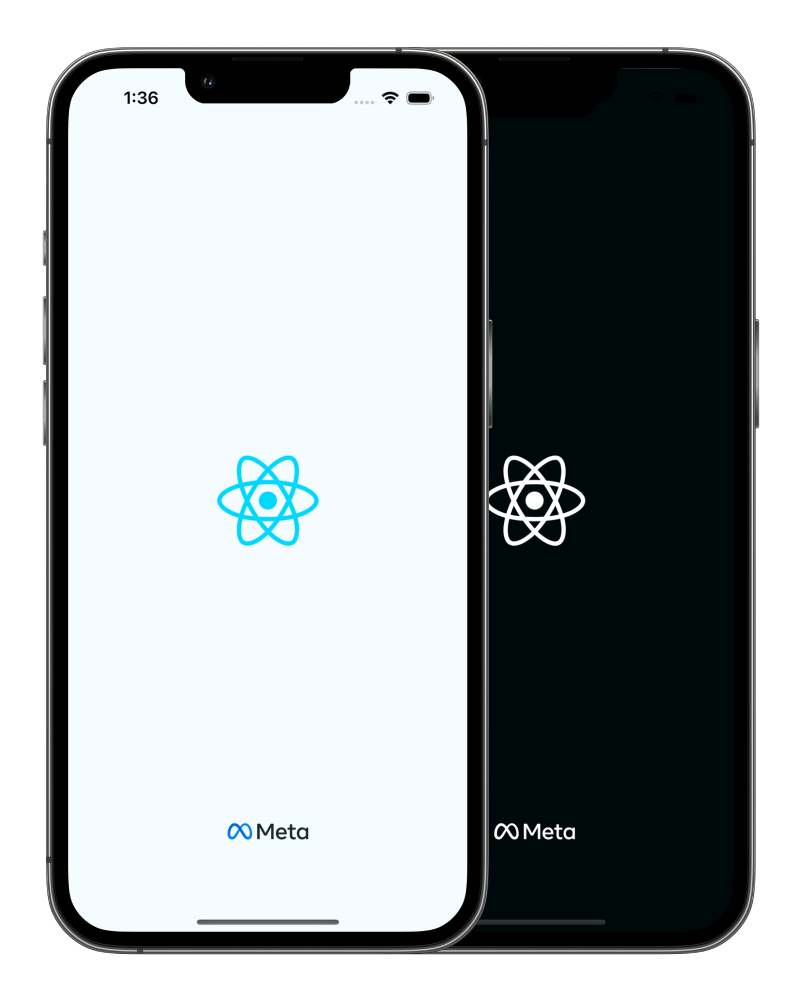
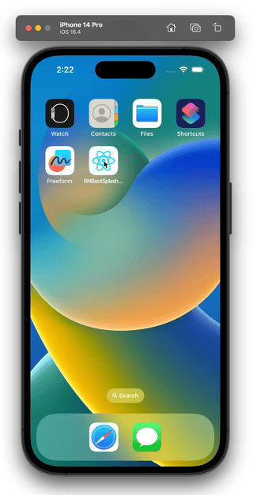
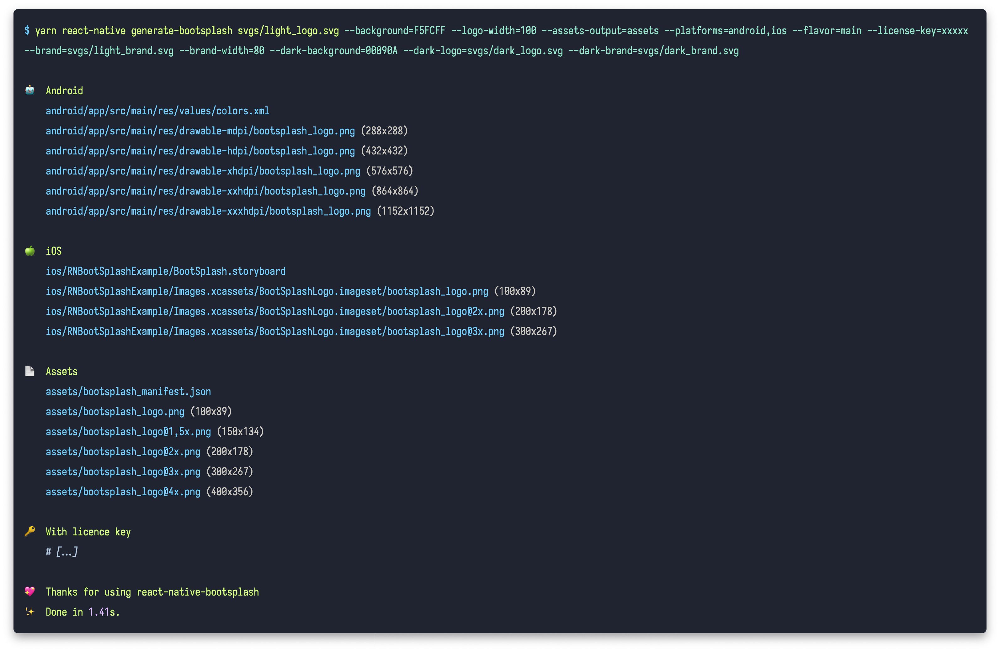
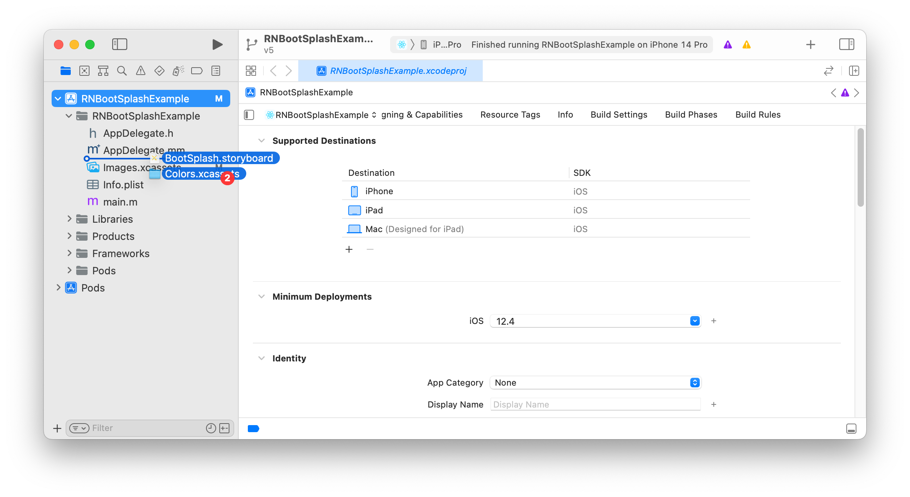
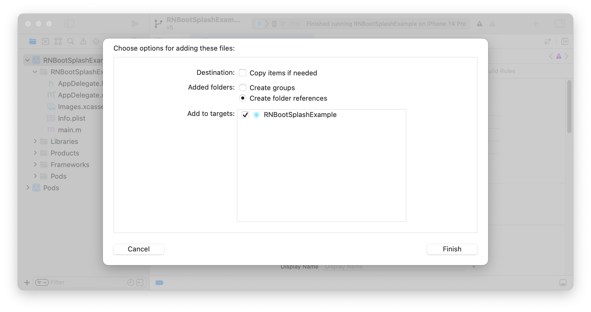
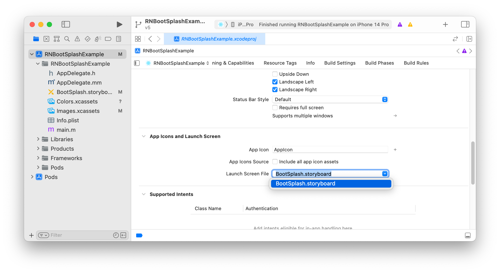

# 🚀 react-native-bootsplash

Show a splash screen during app startup. Hide it when you are ready.<br>
**For migration from the v4, check the [`MIGRATION.md` guide](./MIGRATION.md).**

[](https://github.com/zoontek/react-native-bootsplash/blob/main/LICENSE)
[](https://www.npmjs.org/package/react-native-bootsplash)
[](https://www.npmjs.org/package/react-native-bootsplash)
<br />
[](https://www.android.com)
[](https://developer.apple.com/ios)

<p>
  
  
</p>

## Support

This library follows the React Native [releases support policy](https://github.com/reactwg/react-native-releases#releases-support-policy).<br>
It is supporting the **latest version** and the **two previous minor series**.

## Installation

```bash
$ npm install --save react-native-bootsplash
# --- or ---
$ yarn add react-native-bootsplash
```

_⚠️  Don't forget going into the `ios` directory to execute a `pod install`._

## 🆘 Manual linking

Because this package targets recent React Native versions, you probably don't need to link it manually. But if you have a special case, follow these additional instructions:

<details>
  <summary><b>👀 See manual linking instructions</b></summary>

### iOS

Add this line to your `ios/Podfile` file, then run `pod install`.

```bash
target 'YourAwesomeProject' do
  # …
  pod 'RNBootSplash', :path => '../node_modules/react-native-bootsplash'
end
```

### Android

1. Add the following lines to `android/settings.gradle`:

```gradle
include ':react-native-bootsplash'
project(':react-native-bootsplash').projectDir = new File(rootProject.projectDir, '../node_modules/react-native-bootsplash/android')
```

2. Add the implementation line to the dependencies in `android/app/build.gradle`:

```gradle
dependencies {
  // ...
  implementation project(':react-native-bootsplash')
}
```

3. Add the import and link the package in `MainApplication.java`:

```java
import com.zoontek.rnbootsplash.RNBootSplashPackage; // ⬅️ add the RNBootSplashPackage import

public class MainApplication extends Application implements ReactApplication {

  // …

  @Override
  protected List<ReactPackage> getPackages() {
    @SuppressWarnings("UnnecessaryLocalVariable")
    List<ReactPackage> packages = new PackageList(this).getPackages();
    // …
    packages.add(new RNBootSplashPackage());
    return packages;
  }

  // …
}
```

</details>

## Setup

### Assets generation

In order to speed up the setup, we provide a **CLI** to generate assets, create the Android Drawable XML file and the iOS Storyboard file automatically ✨.

```bash
$ npx react-native generate-bootsplash --help
# --- or ---
$ yarn react-native generate-bootsplash --help
```

The command can take multiple arguments:

```bash
Usage: react-native generate-bootsplash [options] <logo>

Generate a launch screen using a logo file path (PNG or SVG)

Options:
  --platforms <list>          Platforms to generate for, separated by a comma (default: "android,ios,web")
  --background <string>       Background color (in hexadecimal format) (default: "#fff")
  --logo-width <number>       Logo width at @1x (in dp - we recommend approximately ~100) (default: 100)
  --assets-output <string>    Assets output directory path
  --flavor <string>           Android flavor build variant (where your resource directory is) (default: "main")
  --html <string>             HTML template file path (your web app entry point) (default: "index.html")
  --license-key <string>      License key to enable brand and dark mode assets generation
  --brand <string>            Brand file path (PNG or SVG)
  --brand-width <number>      Brand width at @1x (in dp - we recommend approximately ~80) (default: 80)
  --dark-background <string>  [dark mode] Background color (in hexadecimal format)
  --dark-logo <string>        [dark mode] Logo file path (PNG or SVG)
  --dark-brand <string>       [dark mode] Brand file path (PNG or SVG)
  -h, --help                  display help for command
```

#### 💪 Unlock the CLI full potential

In order to use the `--brand`, `--brand-width` and `--dark-*` options, you must specify a `--license-key`.

With it, the generator is able to output over **50 files** (logo and brand images generated in all pixel densities, dark mode versions, etc.), saving you (and your company!) a massive amount of time not only at creation, but also at each adjustment ⏱️

_📍 This license key grants unlimited and unrestricted usage of the generator for the buyer's purposes (meaning you can execute the assets generation as much as you want)._

<a href="https://zoontek.gumroad.com/l/bootsplash-generator">
  
</a>

#### Full command usage example

```bash
# Without license key
yarn react-native generate-bootsplash svgs/light_logo.svg \
  --platforms=android,ios,web \
  --background=F5FCFF \
  --logo-width=100 \
  --assets-output=assets \
  --flavor=main \
  --html=index.html

# With license key 🔑
yarn react-native generate-bootsplash svgs/light_logo.svg \
  --platforms=android,ios,web \
  --background=F5FCFF \
  --logo-width=100 \
  --assets-output=assets \
  --flavor=main \
  --html=index.html \
  --license-key=xxxxx \
  --brand=svgs/light_brand.svg \
  --brand-width=80 \
  --dark-background=00090A \
  --dark-logo=svgs/dark_logo.svg \
  --dark-brand=svgs/dark_brand.svg
```

This tool relies on the naming conventions that are used in the `/example` project and will therefore create the following files:

```bash
# Without license key
android/app/src/main/res/values/colors.xml
android/app/src/main/res/drawable-hdpi/bootsplash_logo.png
android/app/src/main/res/drawable-mdpi/bootsplash_logo.png
android/app/src/main/res/drawable-xhdpi/bootsplash_logo.png
android/app/src/main/res/drawable-xxhdpi/bootsplash_logo.png
android/app/src/main/res/drawable-xxxhdpi/bootsplash_logo.png

ios/RNBootSplashExample/BootSplash.storyboard
ios/RNBootSplashExample/Images.xcassets/BootSplashLogo.imageset/Contents.json
ios/RNBootSplashExample/Images.xcassets/BootSplashLogo.imageset/bootsplash_logo.png
ios/RNBootSplashExample/Images.xcassets/BootSplashLogo.imageset/bootsplash_logo@2x.png
ios/RNBootSplashExample/Images.xcassets/BootSplashLogo.imageset/bootsplash_logo@3x.png

index.html

# Only if --assets-output was specified
assets/bootsplash_manifest.json
assets/bootsplash_logo.png
assets/bootsplash_logo@1,5x.png
assets/bootsplash_logo@2x.png
assets/bootsplash_logo@3x.png
assets/bootsplash_logo@4x.png

# + Over 40 files with license key 🔑 (brand images, dark mode versions…)
```



### iOS

_ℹ️ For `react-native` < `0.71` setup, follow the [`v4.4.0 README.md`](https://github.com/zoontek/react-native-bootsplash/blob/4.4.0/README.md)._

---

1. Edit the `ios/YourProjectName/AppDelegate.mm` file:

```obj-c
#import "AppDelegate.h"
#import "RNBootSplash.h" // ⬅️ add the header import

// …

@implementation AppDelegate

// …

// ⬇️ Add this before file @end
- (UIView *)createRootViewWithBridge:(RCTBridge *)bridge
                          moduleName:(NSString *)moduleName
                           initProps:(NSDictionary *)initProps {
  UIView *rootView = [super createRootViewWithBridge:bridge
                                          moduleName:moduleName
                                           initProps:initProps];

  [RNBootSplash initWithStoryboard:@"BootSplash" rootView:rootView]; // ⬅️ initialize the splash screen

  return rootView;
}

@end
```

2. Drag and drop the generated `BootSplash.storyboard` (and `Colors.xcassets`, when using dark mode):



3. Create folder references:



4. Set `BootSplash.storyboard` as Launch Screen File:



### Android

1. Edit your `android/app/src/main/res/values/styles.xml` file:

```xml
<resources>

  <style name="AppTheme" parent="Theme.AppCompat.DayNight.NoActionBar">
      <!-- Your base theme customization -->
  </style>

  <!-- BootTheme should inherit from Theme.BootSplash or Theme.BootSplash.EdgeToEdge -->
  <style name="BootTheme" parent="Theme.BootSplash">
    <item name="bootSplashBackground">@color/bootsplash_background</item>
    <item name="bootSplashLogo">@drawable/bootsplash_logo</item>
    <item name="bootSplashBrand">@drawable/bootsplash_brand</item> <!-- Only if you have a brand image -->
    <item name="postBootSplashTheme">@style/AppTheme</item>
  </style>

</resources>
```

2. Edit your `android/app/src/main/AndroidManifest.xml` file:

```xml
<manifest xmlns:android="http://schemas.android.com/apk/res/android">

  <!-- … -->

  <application
    android:name=".MainApplication"
    android:label="@string/app_name"
    android:icon="@mipmap/ic_launcher"
    android:roundIcon="@mipmap/ic_launcher_round"
    android:allowBackup="false"
    android:theme="@style/BootTheme"> <!-- Replace @style/AppTheme with @style/BootTheme -->
    <!-- … -->
  </application>
</manifest>

```

3. Finally edit your `android/app/src/main/java/com/yourprojectname/MainActivity.java` file:

```java
// …

// add these required imports:
import android.os.Bundle;
import com.zoontek.rnbootsplash.RNBootSplash;

public class MainActivity extends ReactActivity {

  // …

  @Override
  protected void onCreate(Bundle savedInstanceState) {
    RNBootSplash.init(this, R.style.BootTheme); // ⬅️ initialize the splash screen
    super.onCreate(savedInstanceState); // or super.onCreate(null) with react-native-screens
  }
}
```

## API

### hide()

Hide the splash screen (immediately, or with a fade out).

#### Method type

```ts
type hide = (config?: { fade?: boolean }) => Promise<void>;
```

#### Usage

```tsx
import { useEffect } from "react";
import { Text } from "react-native";
import BootSplash from "react-native-bootsplash";

const App = () => {
  useEffect(() => {
    const init = async () => {
      // …do multiple sync or async tasks
    };

    init().finally(async () => {
      await BootSplash.hide({ fade: true });
      console.log("BootSplash has been hidden successfully");
    });
  }, []);

  return <Text>My awesome app</Text>;
};
```

### isVisible()

Return the current visibility status of the native splash screen.

#### Method type

```ts
type isVisible = () => Promise<boolean>;
```

#### Usage

```ts
import BootSplash from "react-native-bootsplash";

BootSplash.isVisible().then((value) => console.log(value));
```

### useHideAnimation()

A hook to easily creation a hide custom hide animation, by animating all splash screen elements using `Animated`, `react-native-reanimated` or else (similar as the video on top of this documentation).<br>
To use it, don't forget to set the `--assets-output` option of the generator as it requires the manifest and assets images files.

#### Method type

```ts
type useHideAnimation = (config: {
  manifest: Manifest; // the manifest file is generated when --assets-output is specified

  // the required generated assets
  logo?: ImageRequireSource;
  darkLogo?: ImageRequireSource;
  brand?: ImageRequireSource;
  darkBrand?: ImageRequireSource;

  // specify if you are using translucent status / navigation bars
  // in order to avoid a shift between the native and JS splash screen
  statusBarTranslucent?: boolean;
  navigationBarTranslucent?: boolean;

  animate: () => void;
}) => {
  container: ViewProps;
  logo: ImageProps;
  brand: ImageProps;
};
```

#### Usage

```tsx
import { useState } from "react";
import { Animated, Image } from "react-native";
import BootSplash from "react-native-bootsplash";

type Props = {
  onAnimationEnd: () => void;
};

const AnimatedBootSplash = ({ onAnimationEnd }: Props) => {
  const [opacity] = useState(() => new Animated.Value(1));

  const { container, logo /*, brand */ } = BootSplash.useHideAnimation({
    manifest: require("../assets/bootsplash_manifest.json"),

    logo: require("../assets/bootsplash_logo.png"),
    // darkLogo: require("../assets/bootsplash_dark_logo.png"),
    // brand: require("../assets/bootsplash_brand.png"),
    // darkBrand: require("../assets/bootsplash_dark_brand.png"),

    statusBarTranslucent: true,
    navigationBarTranslucent: false,

    animate: () => {
      // Perform animations and call onAnimationEnd
      Animated.timing(opacity, {
        useNativeDriver: true,
        toValue: 0,
        duration: 500,
      }).start(() => {
        onAnimationEnd();
      });
    },
  });

  return (
    <Animated.View {...container} style={[container.style, { opacity }]}>
      <Image {...logo} />
      {/* <Image {...brand} /> */}
    </Animated.View>
  );
};

const App = () => {
  const [visible, setVisible] = useState(true);

  return (
    <View style={{ flex: 1 }}>
      {/* content */}

      {visible && (
        <AnimatedBootSplash
          onAnimationEnd={() => {
            setVisible(false);
          }}
        />
      )}
    </View>
  );
};
```

**This example is simple for documentation purpose (we only animate the container).**<br>
**🤙 A more complex example is available in the [`/example` folder](./example/src/AnimatedBootSplash.tsx).**

## FAQ

### How should I use it with React Navigation?

If you are using React Navigation, you can hide the splash screen once the navigation container and all children have finished mounting by using the `onReady` function.

```tsx
import { NavigationContainer } from "@react-navigation/native";
import BootSplash from "react-native-bootsplash";

const App = () => (
  <NavigationContainer
    onReady={() => {
      BootSplash.hide();
    }}
  >
    {/* content */}
  </NavigationContainer>
);
```

### How can I mock the module in my tests?

Testing code which uses this library requires some setup since we need to mock the native methods.

To add the mocks, create a file `jest/setup.js` (or any other file name) containing the following code:

```ts
jest.mock("react-native-bootsplash", () => {
  return {
    hide: jest.fn().mockResolvedValue(),
    isVisible: jest.fn().mockResolvedValue(false),
    useHideAnimation: jest.fn().mockReturnValue({
      container: {},
      logo: { source: 0 },
      brand: { source: 0 },
    }),
  };
});
```

After that, we need to add the setup file in the jest config. You can add it under [setupFiles](https://jestjs.io/docs/en/configuration.html#setupfiles-array) option in your jest config file:

```json
{
  "setupFiles": ["<rootDir>/jest/setup.js"]
}
```

### Why are both light and dark assets inlined in my index.html?

For the sake of simplicity. Since the light and dark versions of your assets are likely identical (except for the colors), if your `index.html` file is compressed with **gzip**, the size difference will be negligible.

### How can I make my splash screen status bar transparent?

Edit your `values/styles.xml` to set `android:statusBarColor` and `android:windowLightStatusBar` values:

```diff
- <resources>
+ <resources xmlns:tools="http://schemas.android.com/tools">

  <style name="BootTheme" parent="Theme.BootSplash">
    <!-- … -->

+   <!-- Apply color + style to the status bar (true = dark-content, false = light-content) -->
+   <item name="android:statusBarColor" tools:targetApi="m">@color/bootsplash_background</item>
+   <item name="android:windowLightStatusBar" tools:targetApi="m">true</item>
  </style>
```

### How can I apply [edge-to-edge layout](https://developer.android.com/develop/ui/views/layout/edge-to-edge) to my splash screen?

Edit your `values/styles.xml` file to use `Theme.BootSplash.EdgeToEdge` instead of `Theme.BootSplash`:

```diff
- <style name="BootTheme" parent="Theme.BootSplash">
+ <style name="BootTheme" parent="Theme.BootSplash.EdgeToEdge">
```

## Sponsors

This module is provided **as is**, I work on it in my free time.

If you or your company uses it in a production app, consider sponsoring this project 💰. You also can contact me for **premium** enterprise support: help with issues, prioritize bugfixes, feature requests, etc.

<a href="https://github.com/sponsors/zoontek"></a>
